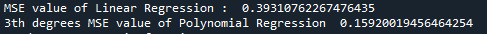
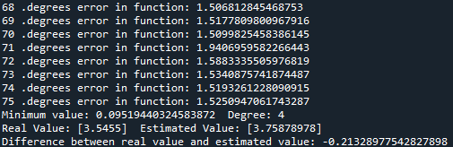
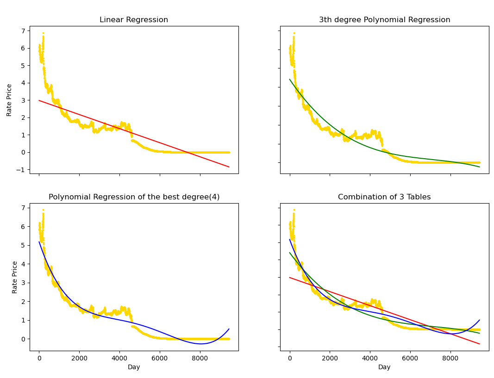

# Dollar Rate Estimate

## Goals of Project

There are daily values of dollar rate of Turkey between half June of 2019 year and 1982 year in **"37.year.dollar.rate.for.Turkey"** csv file. 
I am trying to estimate to new dollar rate that using Machine Learning algorithms in this work. 

## Doing of Project

I was trying this data with Regression Algorithms. I used Linear Regression and Polynomial Regression in this work. I visualized both that using matplotlib library.
First, I estimated that using Linear Regression. Then I estimated that using this Polynomial Regression from 3th degrees. Then I found their MSE values.

Then I determined in Polynomial Regression which degrees that it gave the best result. 
While I determine the best degree, I decided by looking to MSE rate that trying the first 75 degrees. 
Then I applied the best degree and I looked to results.

## The Results
The result, Polynomial Regression degree that giving the lowest MSE rate value was 4th degrees. 
Then I tried 4th degrees in Polynomial Regression and i took the result.
After I looked to differences between real value and estimated value. It gave a pretty lowest value.

The end, I created each other different of 4 tables. There are real values (scatter plot) and estimated values (line plot) inside tables.

